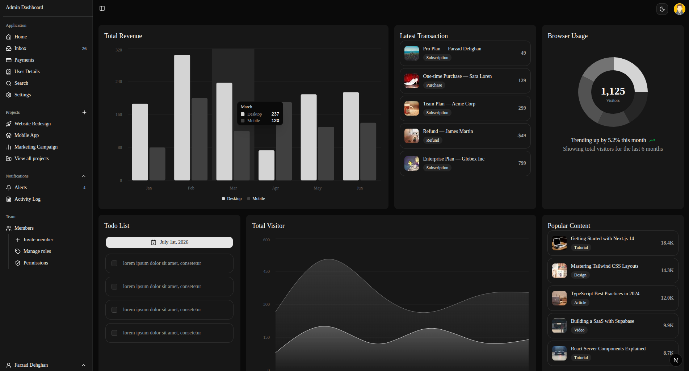
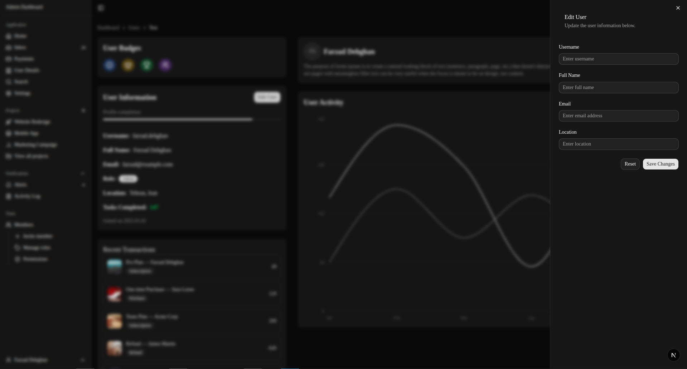
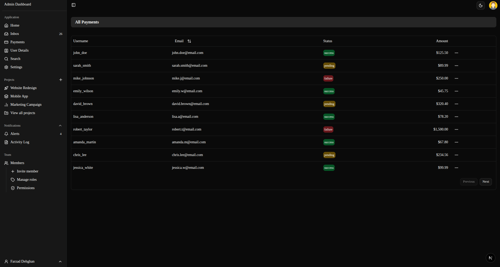

# 🚀 Admin Dashboard

A modern admin dashboard built with Next.js 16, Shadcn UI, and Tailwind CSS.

## 📖 Overview

A clean, responsive admin dashboard for managing users and payments with a modern UI/UX design. Built as a practice project to demonstrate the power of Shadcn UI components with Next.js.

## ✨ Features

### Core Features
- 🎨 **Modern UI** - Beautiful components from Shadcn UI
- 🌙 **Dark/Light Mode** - Toggle themes with system preference detection
- 📱 **Fully Responsive** - Optimized for all screen sizes

### Admin Features
- 👥 **User Management** - Browse user profiles with detail views
- 💳 **Payment Management** - Track and manage payment transactions with sortable/filterable table
- 📊 **Dashboard** - Quick overview of key metrics
- 📈 **Interactive Charts** - Visualize data with charts 
- 🔍 **Advanced Tables** - Sortable, filterable data tables with pagination
- ✏️ **Inline Actions** - Copy payment IDs, view customer details

## 🛠️ Tech Stack

- **Next.js 16** - React Framework with App Router
- **React 18** - UI Library
- **TypeScript** - Type Safety
- **Shadcn UI** - Component Library
- **Tailwind CSS** - Styling
- **Lucide React** - Icons
- **TanStack Table** - Data Tables
- **React Hook Form** - Form Management
- **Zod** - Schema Validation

## 📁 Routes

```
/                   - Dashboard
/users/[username]   - User Detail Page
/payments           - Payment Management
```


## 📸 Screenshots

### Dashboard


### User Detail


### Payments Table


## 🎥 Demo

